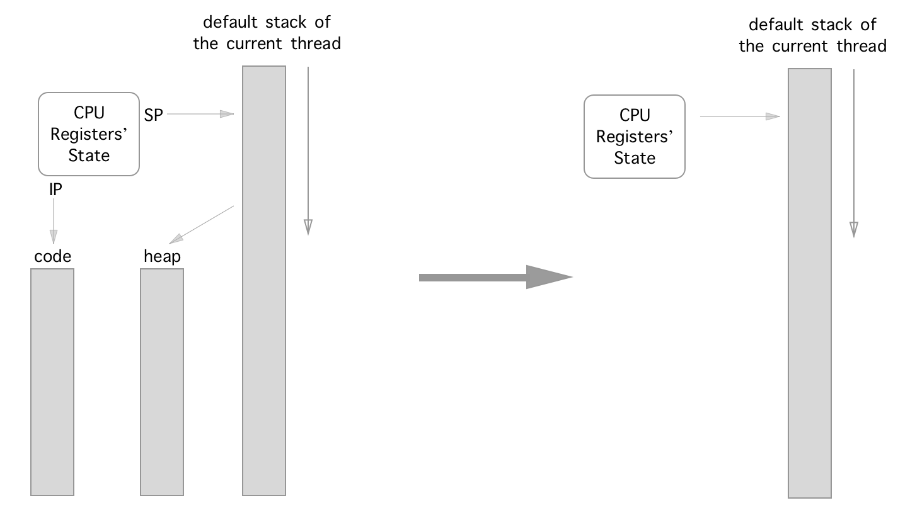
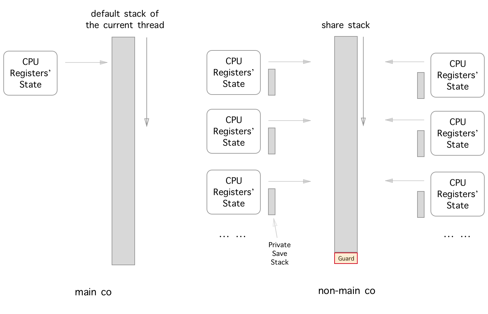
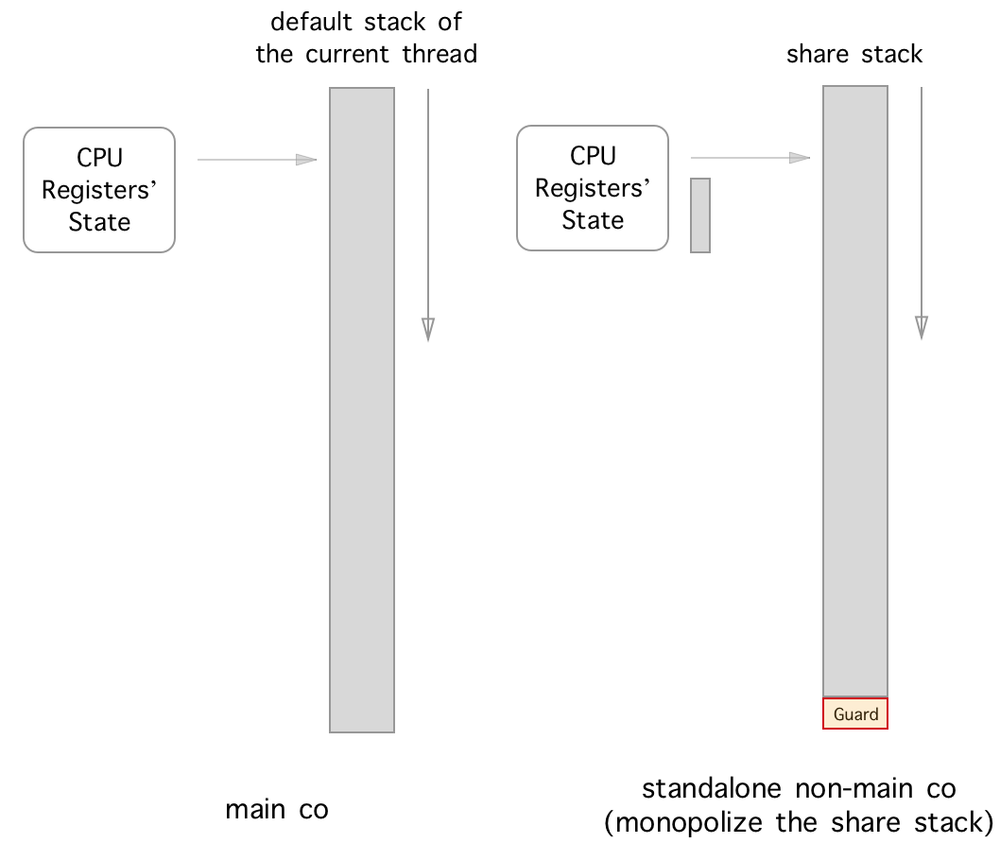
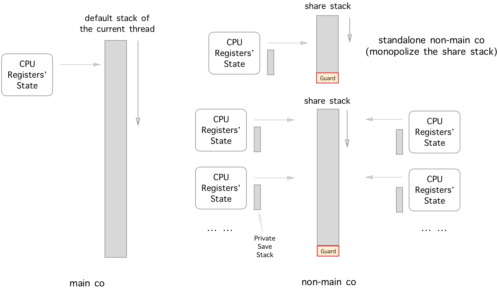

## Model description



There are 4 basic elements of an ordinary execution state: `{cpu_registers, code, heap, stack}`.

Since the code information is indicated by `({E|R})?IP` register, and the address of the memory allocated from heap is normally stored in the stack directly or indirectly, thus we could simplify the 4 elements into only 2 of them: `{cpu_registers, stack}`.



We define the `main co` as the coroutine who monopolizes the default stack of the current thread. And since the main co is the only user of this stack, we only need to save/restore the necessary cpu registers' state of the main co when it's been yielded-from/resumed-to (switched-out/switched-in).

Next, the definition of the `non-main co` is the coroutine whose execution stack is a stack which is not the default stack of the current thread and may be shared with the other non-main co. Thus the non-main co must have a `private save stack` memory buffer to save/restore its execution stack when it is been switched-out/switched-in (because the succeeding/preceding co may would/had use/used the share stack as its execution stack).



There is a special case of non-main co, that is `standalone non-main co` what we called in libaco: the share stack of the non-main coroutine has only one co user. Thus there is no need to do saving/restoring stuff of its private save stack when it is been switched-out/switched-in since there is no other co will touch the execution stack of the standalone non-main co except itself.



Finally, we get the big picture of libaco.

There is a [proof of correctness](proof-of-correctness) part you may find really helpful if you want to dive into the internal of libaco or want to implement your own coroutine library.

It is also highly recommended to read the source code of the tutorials and benchmark next. The [benchmark](benchmark) result is very impressive and enlightening too.

## Synopsis

### The code

```c
#include "aco.h"    
#include <stdio.h>

// this header would override the default C `assert`;
// you may refer the "API : MACROS" part for more details.
#include "aco_assert_override.h"

void foo(int ct) {
    printf(
            "co: %p: yield to main_co: %d\n", 
            aco_get_co(), 
            *((int*) aco_get_arg()));
    
    aco_yield();
    *((int*) aco_get_arg()) = ct + 1;
}

void co_fp0() {
    printf(
            "co: %p: entry: %d\n",
            aco_get_co(),
            *((int*) aco_get_arg()));
    
    int ct = 0;
    while (ct < 6) {
        foo(ct);
        ct++;
    }
    
    printf(
            "co: %p:  exit to main_co: %d\n",
            aco_get_co(),
            *((int*) aco_get_arg()));
    
    aco_exit();
}

int main() {
    aco_thread_init(NULL);

    aco_t* main_co = aco_create(
            NULL, NULL, 0, NULL, NULL);
    aco_share_stack_t* sstk = aco_share_stack_new(0);

    int co_ct_arg_point_to_me = 0;
    aco_t* co = aco_create(
            main_co,
            sstk,
            0,
            co_fp0,
            &co_ct_arg_point_to_me);

    int ct = 0;
    while (ct < 6) {
        assert(co->is_end == 0);
        printf("main_co: yield to co: %p: %d\n", co, ct);
        aco_resume(co);
        assert(co_ct_arg_point_to_me == ct);
        ct++;
    }
    
    printf("main_co: yield to co: %p: %d\n", co, ct);
    
    aco_resume(co);
    
    assert(co_ct_arg_point_to_me == ct);
    assert(co->is_end);

    printf("main_co: destroy and exit\n");
    
    aco_destroy(co);
    co = NULL;
    aco_share_stack_destroy(sstk);
    sstk = NULL;
    aco_destroy(main_co);
    main_co = NULL;

    return 0;
}
```

### The build and test

```bash
# default build
$ gcc -g -O2 acosw.S aco.c test_aco_synopsis.c -o test_aco_synopsis
$ ./test_aco_synopsis
main_co: yield to co: 0x1887120: 0
co: 0x1887120: entry: 0
co: 0x1887120: yield to main_co: 0
main_co: yield to co: 0x1887120: 1
co: 0x1887120: yield to main_co: 1
main_co: yield to co: 0x1887120: 2
co: 0x1887120: yield to main_co: 2
main_co: yield to co: 0x1887120: 3
co: 0x1887120: yield to main_co: 3
main_co: yield to co: 0x1887120: 4
co: 0x1887120: yield to main_co: 4
main_co: yield to co: 0x1887120: 5
co: 0x1887120: yield to main_co: 5
main_co: yield to co: 0x1887120: 6
co: 0x1887120:  exit to main_co: 6
main_co: destroy and exit
# i386
$ gcc -g -m32 -O2 acosw.S aco.c test_aco_synopsis.c -o test_aco_synopsis
# share fpu and mxcsr env
$ gcc -g -D ACO_CONFIG_SHARE_FPU_MXCSR_ENV -O2 acosw.S aco.c test_aco_synopsis.c -o test_aco_synopsis 
# with valgrind friendly support
$ gcc -g -D ACO_USE_VALGRIND -O2 acosw.S aco.c test_aco_synopsis.c -o test_aco_synopsis
$ valgrind --leak-check=full --tool=memcheck ./test_aco_synopsis
```

For more information abot how to build you may refer to the [build and test](build-and-test).