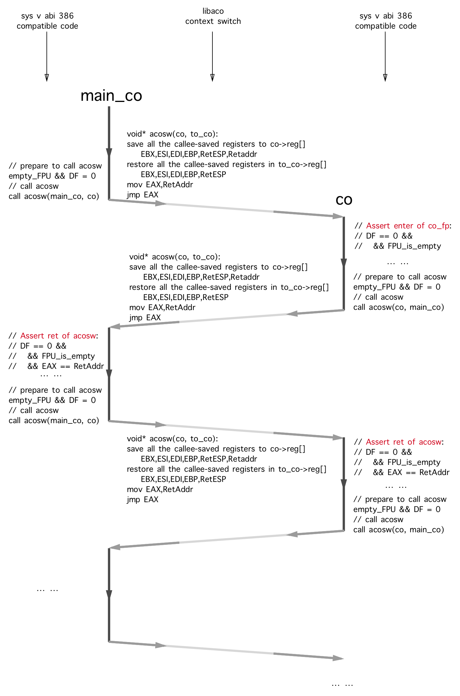
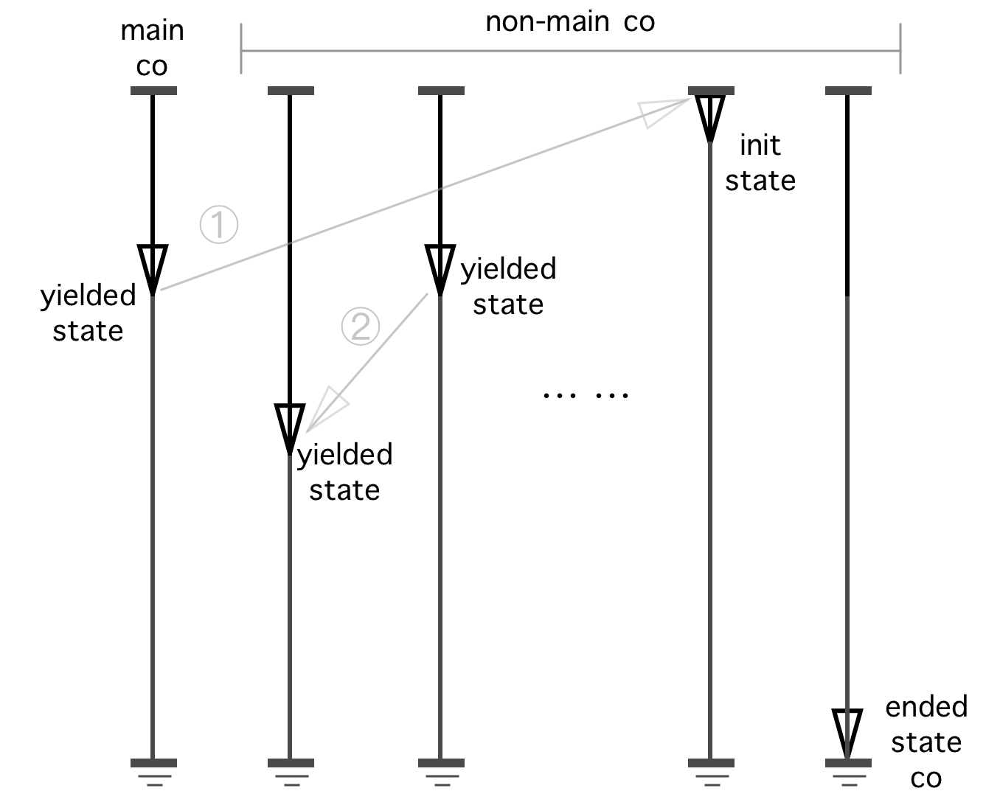
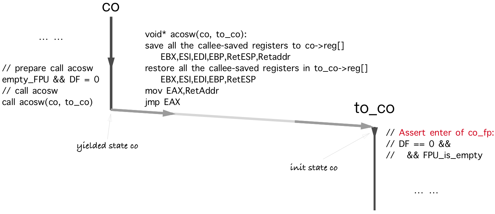
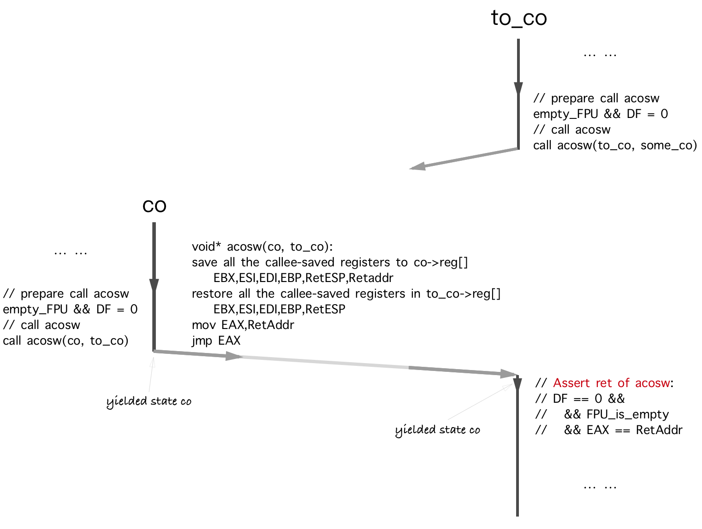

It is essential to be very familiar with the standard of [Sys V ABI of intel386 and x86-64](https://github.com/hjl-tools/x86-psABI/wiki/X86-psABI) before you start to implement or prove a coroutine library.

The proof below has no direct description about the IP (instruction pointer), SP (stack pointer) and the saving/restoring between the private save stack and the share stack, since these things are pretty trivial and easy to understand when they are compared with the ABI constraints stuff.

## Running Model

In the OS thread, the main coroutine `main_co` is the coroutine who should be created and started to execute first, before all the other non-main coroutines do.

The next diagram is a simple example of the context switching between main_co and co.

In this proof, we just assume that we are under Sys V ABI of intel386 since there is no fundamental differences between the Sys V ABI of intel386 and x86-64. We also assume that none of the code would change the control words of FPU and MXCSR.



The next diagram is actually a symmetric coroutine's running model which has an unlimited number of non-main co-s and one main co. This is fine because the asymmetric coroutine is just a special case of the symmetric coroutine. To prove the correctness of the symmetric coroutine is a little more challenging than of the asymmetric coroutine and thus more fun it would become. (libaco only implemented the API of asymmetric coroutine currently because the semantic meaning of the asymmetric coroutine API is far more easy to understand and to use than the symmetric coroutine does.)



Since the main co is the 1st coroutine starts to run, the 1st context switching in this OS thread must be in the form of `acosw(main_co, co)` where the 2nd argument `co` is a non-main co.

## Mathematical Induction

It is easy to prove that there only exists two kinds of state transfer in the above diagram:

* yielded state co → init state co
* yielded state co → yielded state co

To prove the correctness of `void* acosw(aco_t* from_co, aco_t* to_co)` implementation is equivalent to prove all the co constantly comply to the constraints of Sys V ABI before and after the call of `acosw`. We assume that the other part of binary code (except `acosw`) in the co had already comply to the ABI (they are normally generated by the compiler correctly).

Here is a summary of the registers' constraints in the Function Calling Convention of Intel386 Sys V ABI:

```
Registers' usage in the calling convention of the Intel386 System V ABI:
    caller saved (scratch) registers:
        C1.0: EAX
            At the entry of a function call:
                could be any value
            After the return of `acosw`:
                hold the return value for `acosw`
        C1.1: ECX,EDX
            At the entry of a function call:
                could be any value
            After the return of `acosw`:
                could be any value
        C1.2: Arithmetic flags, x87 and mxcsr flags
            At the entry of a function call:
                could be any value
            After the return of `acosw`:
                could be any value
        C1.3: ST(0-7)
            At the entry of a function call:
                the stack of FPU must be empty
            After the return of `acosw`:
                the stack of FPU must be empty
        C1.4: Direction flag
            At the entry of a function call:
                DF must be 0
            After the return of `acosw`:
                DF must be 0
        C1.5: others: xmm*,ymm*,mm*,k*...
            At the entry of a function call:
                could be any value
            After the return of `acosw`:
                could be any value
    callee saved registers:
        C2.0: EBX,ESI,EDI,EBP
            At the entry of a function call:
                could be any value
            After the return of `acosw`:
                must be the same as it is at the entry of `acosw` 
        C2.1: ESP
            At the entry of a function call:
                must be a valid stack pointer
                (alignment of 16 bytes, retaddr and etc...)
            After the return of `acosw`:
                must be the same as it is before the call of `acosw`
        C2.2: control word of FPU & mxcsr
            At the entry of a function call:
                could be any configuration
            After the return of `acosw`:
                must be the same as it is before the call of `acosw` 
                (unless the caller of `acosw` assume `acosw` may    \
                change the control words of FPU or MXCSR on purpose \
                like `fesetenv`)
```

(For Intel386, the register usage is defined in the "P13 - Table 2.3: Register Usage" of [Sys V ABI Intel386 V1.1](https://github.com/hjl-tools/x86-psABI/wiki/X86-psABI), and for AMD64 is in "P23 - Figure 3.4: Register Usage" of [Sys V ABI AMD64 V1.0](https://github.com/hjl-tools/x86-psABI/wiki/X86-psABI).)

**Proof:**

1. yielded state co -> init state co:



The diagram above is for the 1st case: "yielded state co -> init state co".

Constraints: C 1.0, 1.1, 1.2, 1.5 (*satisfied* ✓ )

The scratch registers below can hold any value at the entry of a function:

```
EAX,ECX,EDX
XMM*,YMM*,MM*,K*...
status bits of EFLAGS,FPU,MXCSR
```

Constraints: C 1.3, 1.4 (*satisfied* ✓ )

Since the stack of FPU must already be empty and the DF must already be 0 before `acosw(co, to_co)` was called (the binary code of co is already complied to the ABI), the constraint 1.3 and 1.4 is complied by `acosw`.

Constraints: C 2.0, 2.1, 2.2 (*satisfied* ✓ )

C 2.0 & 2.1 is already satisfied. Since we already assumed that nobody will change the control words of FPU and MXCSR, C 2.2 is satisfied too.

2. yielded state co -> yielded state co:



The diagram above is for the 2nd case: yielded state co -> yielded state co.

Constraints: C 1.0 (*satisfied* ✓ )

EAX already holding the return value when `acosw` returns back to to_co (resume).

Constraints: C 1.1, 1.2, 1.5 (*satisfied* ✓ )

The scratch registers below can hold any value at the entry of a function and after the return of `acosw`:

```
ECX,EDX
XMM*,YMM*,MM*,K*...
status bits of EFLAGS,FPU,MXCSR
```

Constraints: C 1.3, 1.4 (*satisfied* ✓ )

Since the stack of FPU must already be empty and the DF must already be 0 before `acosw(co, to_co)` was called (the binary code of co is already complied to the ABI), the constraint 1.3 and 1.4 is complied by `acosw`.

Constraints: C 2.0, 2.1, 2.2 (*satisfied* ✓ )

C 2.0 & 2.1 is satisfied because there is saving & restoring of the callee saved registers when `acosw` been called/returned. Since we already assumed that nobody will change the control words of FPU and MXCSR, C 2.2 is satisfied too.

3. Mathematical induction:

The 1st `acosw` in the thread must be the 1st case: yielded state co -> init state co, and all the next `acosw` must be one of the 2 case above. Sequentially, we could prove that "all the co constantly comply to the constraints of Sys V ABI before and after the call of `acosw`". Thus, the proof is finished.

## Miscellaneous

### Red Zone

There is a new thing called [red zone](https://en.wikipedia.org/wiki/Red_zone_(computing)) in System V ABI x86-64:

> The 128-byte area beyond the location pointed to by %rsp is considered to be reserved and shall not be modified by signal or interrupt handlers. Therefore, functions may use this area for temporary data that is not needed across function calls. In particular, leaf functions may use this area for their entire stack frame, rather than adjusting the stack pointer in the prologue and epilogue. This area is known as the red zone.

Since the red zone is "not preserved by the callee", we just do not care about it at all in the context switching between coroutines (because the `acosw` is a leaf function).

### Stack Pointer

> The end of the input argument area shall be aligned on a 16 (32 or 64, if \_\_m256 or \_\_m512 is passed on stack) byte boundary. In other words, the value (%esp + 4) is always a multiple of 16 (32 or 64) when control is transferred to the function entry point. The stack pointer, %esp, always points to the end of the latest allocated stack frame.
>
> — Intel386-psABI-1.1:2.2.2 The Stack Frame

> The stack pointer, %rsp, always points to the end of the latest allocated stack frame.
>
> — Sys V ABI AMD64 Version 1.0:3.2.2 The Stack Frame

Here is a [bug example](https://github.com/Tencent/libco/blob/v1.0/coctx_swap.S#L27) in Tencent's libco. The ABI states that the `(E|R)SP` should always point to the end of the latest allocated stack frame. But in file [coctx_swap.S](https://github.com/Tencent/libco/blob/v1.0/coctx_swap.S#L27) of libco, the `(E|R)SP` had been used to address the memory on the heap.

>**By default, the signal handler  is invoked  on  the normal process stack.**  It is possible to arrange that the signal handler uses an alternate stack; see sigalstack(2)  for  a discussion of how to do this and when it might be useful.
>
>— man 7 signal : Signal dispositions

Terrible things may happen if the `(E|R)SP`  is pointing to the data structure on the heap when signal comes. (Using the `breakpoint` and `signal` commands of gdb could produce such bug conveniently. Although by using `sigalstack` to change the default signal stack could alleviate the problem, but still, that kind of usage of `(E|R)SP` still violates the ABI.)
